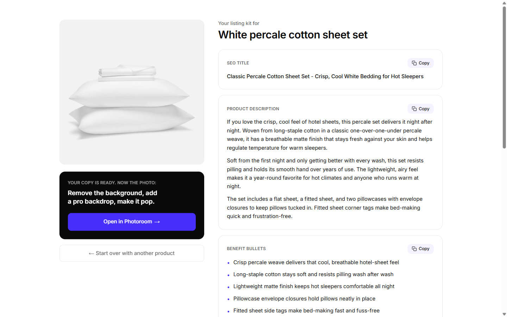

# ListingRoom

Writing the listing is the part every seller hates. ListingRoom does it from one product photo, in seconds, for free.

Live: **[listingroom.pablo.ky](https://listingroom.pablo.ky)**



## What it does

Give it a product. It writes the whole listing:

- **SEO title** (keyword front-loaded, 60-80 chars)
- **Product description** (2-3 tight paragraphs)
- **5 benefit bullets**
- **3 ad copy variants** (different angles)
- **1 social caption**
- **10-15 keywords** buyers actually search

Two ways in:

- **Upload a photo.** Drag in a JPEG, PNG, WebP or GIF.
- **Paste a URL.** Drop a product page link and ListingRoom pulls the image and existing copy for you.

The result page has a single CTA: **Open in Photoroom**. The words are the free hook. The visual is the natural next step.

## How it works

One page. One API route. One Claude call.

- **The Claude call** goes to `claude-opus-4-8` with vision and a JSON schema response. The model reads the actual photo, so the copy describes the real product and never invents specs it cannot see.
- **URL mode** tries Shopify's public `/products/<handle>.json` first, then falls back to Open Graph tags. Amazon and Etsy block server requests. The tool doesn't pretend otherwise: it tells you and offers photo upload instead.
- **SSRF-guarded.** Private hosts and resolved private IPs are rejected before every request, including on each redirect hop. HTML responses are capped at 5 MB. Scraped image URLs are re-validated before download.
- **Abuse protection.** In-memory rate limit (3 generations per hour per IP), 5 MB image cap, jpeg/png/webp/gif only, base64 payload validated before it reaches the model.

Deliberately **not** here: no database, no auth, no analytics, no tracking. The product is the output, not your data.

## Run it locally

```bash
npm install
cp .env.example .env.local   # add your ANTHROPIC_API_KEY
npm run dev                  # http://localhost:3000
```

Run the test suite:

```bash
npm test
```

Stack: Next.js 14 (App Router), TypeScript, Tailwind.

## Run with Docker

```bash
docker compose up --build    # reads .env.local, serves on :3000
```

## Why this exists

I built ListingRoom in one day, as a growth-marketing portfolio piece for Photoroom.

The thesis is simple. Sellers need listing copy before they need anything else. Give them that for free, from their real product, and the next step is obvious: the photo. That's Photoroom.

The trick isn't the AI. It's the handoff.

A few honest decisions along the way:

1. **No Amazon/Etsy scraping.** They block server requests. Faking it with a scraping API was possible but added cost and fragility to a one-day build, so the tool says so and falls back to photo upload.
2. **No analytics in v1.** The funnel I would measure (upload → generate → copy → CTA click) is designed, not shipped. Shipping the loop mattered more than instrumenting it on day one.
3. **One model call, not a pipeline.** Vision plus structured outputs in a single request keeps it fast, cheap (about $0.05 per kit) and hard to break.

Phase two is where this gets interesting: programmatic SEO category pages to compound the organic surface, funnel analytics to measure the handoff, a scraping API to cover Amazon and Etsy.

The design language intentionally echoes Photoroom (ink `#0A0A0A`, accent `#492FFB`, Inter, generous whitespace), extracted from photoroom.com itself.

Made with ♥ for Photoroom by Pablo Sánchez. Not affiliated with Photoroom.
